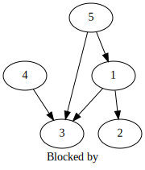

# Use graphviz to visualize issue dependencies

Have an input file filled with the issue relations, output it as an SVG and commit it back to the repository. Use an
GitHub action to do so.

## SVG output

